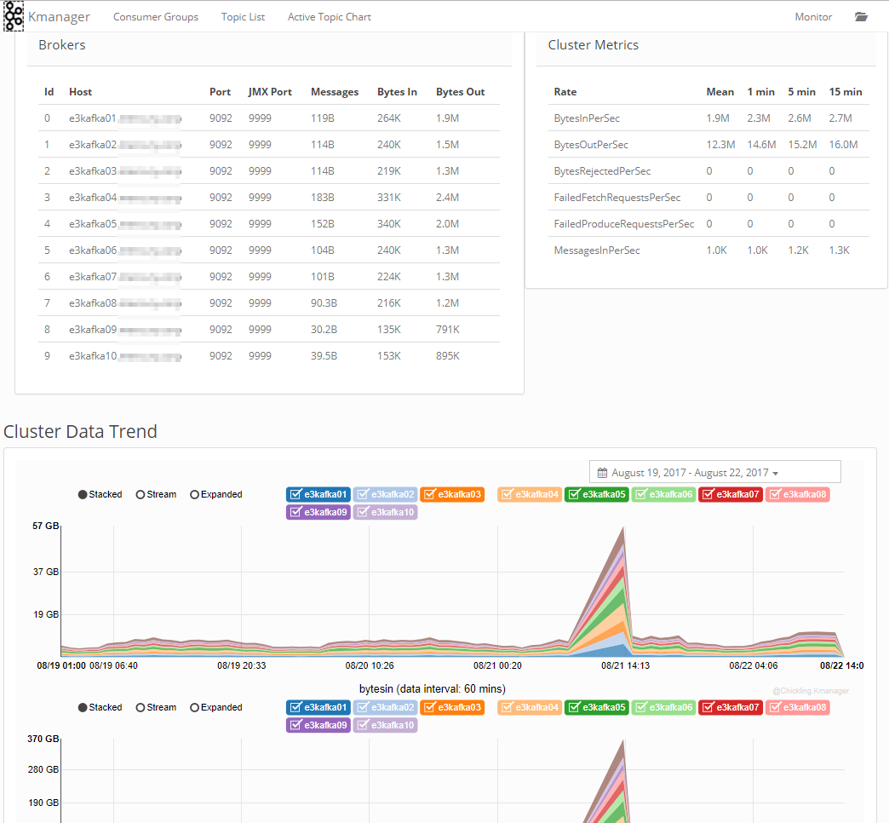
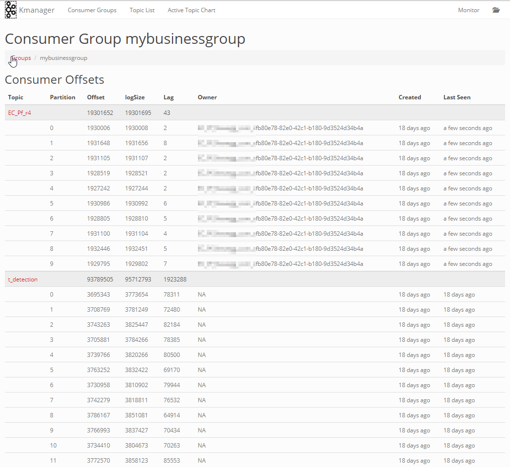
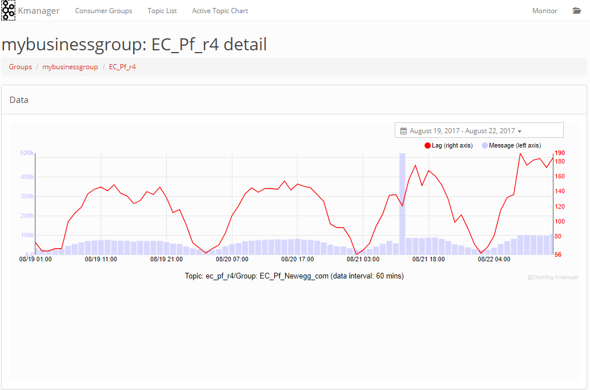

# KManager

[](https://www.apache.org/licenses/LICENSE-2.0.html)
[](https://github.com/chickling/kmanager/wiki/Downloads)

Tool for monitor kafka customer consumer based information, include near realtime offset/lag monitor.

This project is based on [KafkaOffsetMonitor](https://github.com/quantifind/KafkaOffsetMonitor), include all the feature `KafkaOffsetMonitor` have and other features.

### Data sources

- Kafka `JMX` data, you'd better to open JMX on your kafka to know more on your cluster.
- Kafka `Zookeeper` daata

### Features

The ability you can see through Chickling Kmanager:

- Kafka cluster data metrics like bytesIn/bytesOut/MessageIn
- Broker level data
- Topic consumer status
- lag monitor
- and more...

## Screenshots




## Deployment

### Start use Jar file

This project is a maven project, you can manualy build it, just run:

`mvn clean package`

or download the official latest version jar file through `release` tab.

Then, you can use below command to run:

`java -jar ChicklingKManager.jar`

Or, give it a different port rather than default(8099):

`java -jar ChicklingKManager.jar --server.port=8080`

Extra setting will be set within setting page:


### Run with Docker

```
docker run -it -p 8099:8099 --name kmanager chickling/kmanager:0.0.1
```

Then, you can start your journey through below address (use your real host):
```
http://localhost:8099
```

## Contributors

- [Luva](https://github.com/Hulva) (major contributor)
