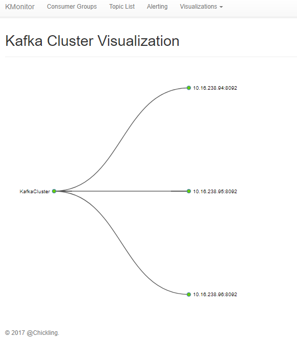
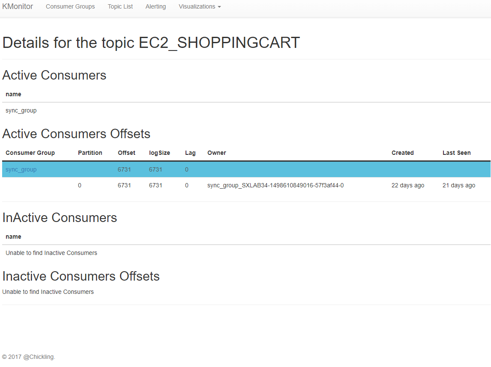
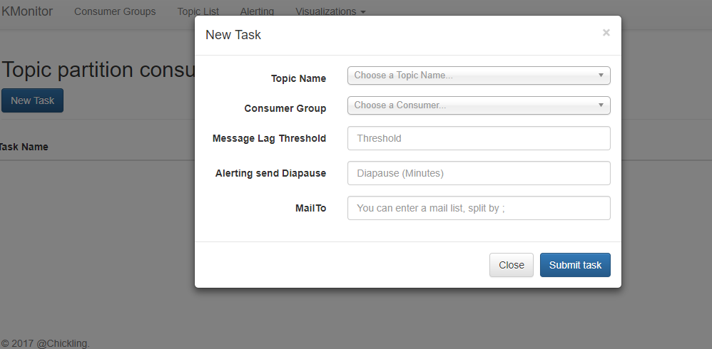
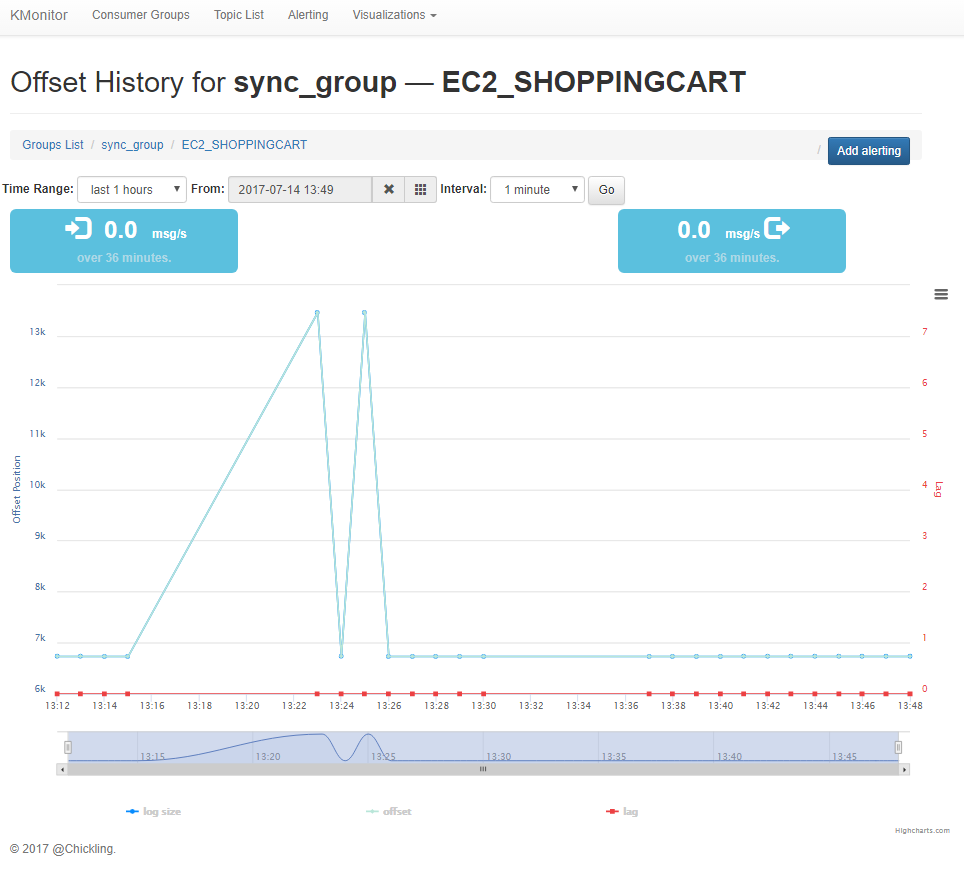
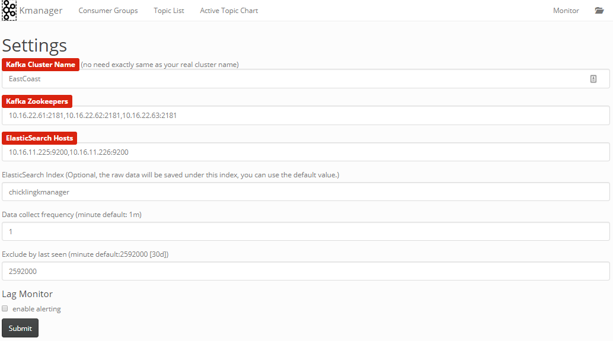

# KMonitor

Tool for monitor kafka customer consumer based information, include near realtime offset/lag monitor.

This project is based on [KafkaOffsetMonitor](https://github.com/quantifind/KafkaOffsetMonitor), include all the feature `KafkaOffsetMonitor` have and also have below changes:

- Meta-data from sqllite to elasticsearch, make the application more stable with large cluster and can persist more longer history data based on your elasticsearch cluster status.
- Lag montior
- More data representation will add later

## Contributors

- [Luva](https://github.com/Hulva) (major contributor)

## Screenshots

### 1. Cluster view




### 2. Detail of consumer group


### 3. Detail of topic



### 4. Alert task (Kafka Lag monitor)



### 5. Trend Chart



## Deployment

### Start use Jar file

This project is a maven project, you can manualy build it, just run:

`mvn clean package`

or download the official latest version jar file through `release` tab.

Then, you can use below command to run:

`java -jar ChicklingKmonitor.jar`

Or, give it a different port rather than default(8099):

`java -jar ChicklingKmonitor.jar --server.port=8080`

Extra setting will be set within setting page:




### Run with Docker

```
TODO:
```

## Add new feature with kafka offset monitor
- 用java语言开发		    
- DB的优化，把监控数据默认写入Elasticsearch，提高查询监控数据的响应时间和存储时间 ，<del>同时也提供对JDBC的实现，方便User快速Run起demo例子</del>
- 在Kafka offset monitor基础上加入对Kafka cluster的监控，当集群中有broker宕机时发Email给集群的管理员
- 加入对topic consumer在每个partition上消费延迟的监控，当消费在partition上的延迟达到给定的阀值值，发Email给相关的人员
- 提供docker部署方案

## TODO

- <del>修改offset 历史展示为可选的时间段和时间间隔</del> **done**
- broker 节点变动邮件通知（zk 节点监听）
- <del>添加专门的设置页面来初始化配置而不是使用配置文件。使用ES来存储配置、alerting task信息。</del> **done** (配置项不多，现采用文件存储) 
- topic/group 列表提供筛选功能
- <del>Alerting task添加入口（在offset history页面已有添加alerting task入口）。Alerting task展示页面添加新的入口。</del> **done**
- 添加更多更详细的topic 的细节信息在Topic details 页面 (JMX 获取的数据？)


